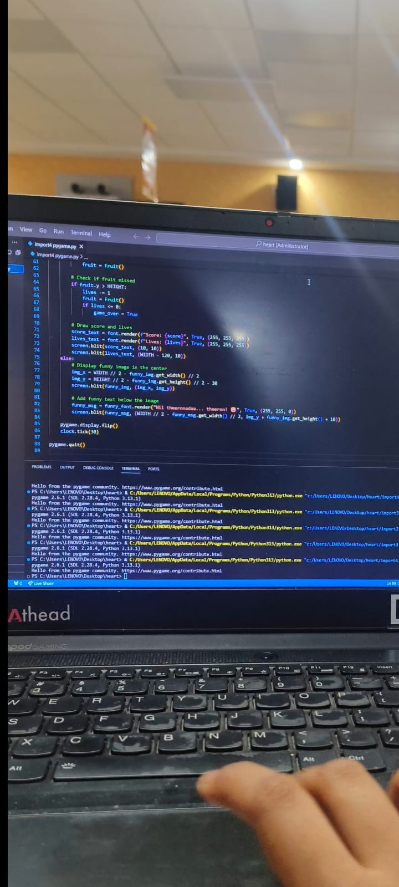

# [Catch me if you can] 🎯

## Basic Details
### Team Name: [Flex]

### Team Members
- Member 1: [Nandana] - [NSS ENGINEERING COLLEGE]
- Member 2: [Maya] - [NSS ENGINEERING COLLEGE]

### Project Description
[A fun game using python ]

### The Problem (that doesn't exist)
[nothing ]

### The Solution (that nobody asked for)
[]

## Technical Details
### Technologies/Components Used
For Software:
- [python]
- [opencv with pygame]
- [opencv-pygame]
- [vs code]

For Hardware:
- [List main components]
- [List specifications]
- [List tools required]

### Implementation
For Software:
# Installation
[commands]

# Run
[commands]

### Project Documentation
For Software:

# Screenshots (Add at least 3)

*Add caption explaining what this shows*

# Diagrams

*Add caption explaining your workflow*

For Hardware:

# Schematic & Circuit

*Add caption explaining connections*

*Add caption explaining the schematic*

# Build Photos

*List out all components shown*

*Explain the build steps*

*Explain the final build*

### Project Demo
# Video
[Add your demo video link here]
*Explain what the video demonstrates*

# Additional Demos
[Add any extra demo materials/links]

## Team Contributions
- [Maya]: [debugging ]
- [Nandana]: [executing ]
  

---
Made with ❤️ at TinkerHub Useless Projects 

